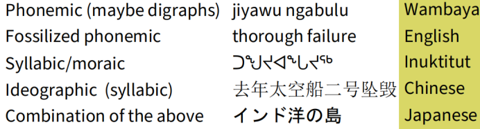
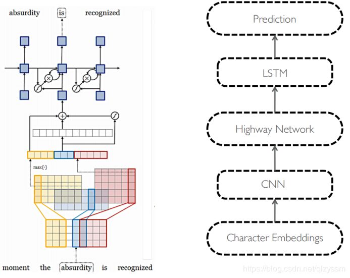

## Subwords

### 1. Linguistics

#### 1.1 Phonetics & Phonology
+ Phonetics: Phonetics is a branch of linguistics that studies how humans make and perceive sounds, or in the case of sign languages, the equivalent aspects of sign. 
+ Phonology: Phonology is a branch of linguistics that studies how languages group sounds together. It supposed that there are some basic meaningful units in spoken languages such as *phonemes*.

#### 1.2 Morphology
+ Morphology takes the *morphemes* as the smallest meaningful units in a language.
+ There're great differences among different written languages. For example, Chinese has no space between 2 words, but in English, 2 words are seperated by a space.
+ In the real world, there're lots of words formed by rich morphology, trasliteration and informal spelling such as abbreviation.

Caused by the huge differences in written languages, building a model merely based on word-level is far less than enough. Therefore, it neccessary to dig deeper into subword models in those related fields.

### 2. Subword-Level Language Models
The advantages of subword-level language models include:
1. It could acquire the characters by encoding different morphs of the same word.
2. It could sovle the problem of OOV (out of vocabulary).
3. It could achive comparable expressivity as word-level models but with less parameters.

A very typical example is *Character-Aware Neural Language Models*. It proposes a language model that leverages subword information through a character-level CNN, whose output is used as an input to a recurrent neural network language model (RNN-LM).

The architecture of the model is shown above. It's composed by 3 parts:
1. Char-level CNN: The sentences are decoded as character embeddings as the inputs of a CNN and a Max Pooling layer.
2. HighWay Network: Instead of using Multi-Layer Perception (MLP), the author obtained  great improvement by running through *highway network*.
3. LSTM: The layer connect the output from highway network and the output layer.

Despite using fewer parameters, the model outperforms baseline models that utilize word/morpheme embeddings in the input layer. Analysis of word representations obtained from the character composition part of the model further indicates that the model is able to encode, from characters only, rich semantic and orthographic features.
