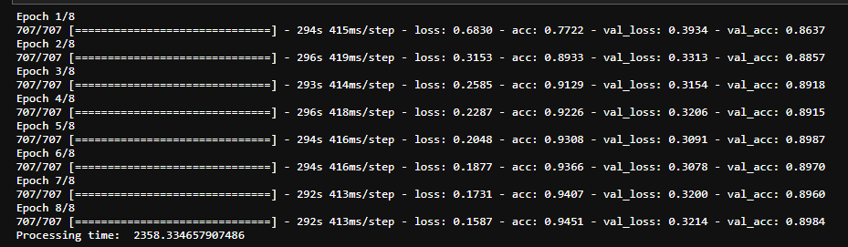
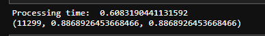

[TOC]

## 项目介绍

### 项目任务

本次项目旨在实现中文文本分类，并比较*LSTM*与*FastText*两种实现方式的差异。

### 数据说明

本次项目使用数据收集于各电商共计10类商品的用户评论。

10类商品包括：书籍、平板、手机、水果、洗发水、热水器、蒙牛、衣服、计算机、酒店。

评论总计约6万条，其中正、负向评论各约3万条。

## 文件目录

本次工程包括以下几个文件：
+ data: 存放此次任务所需的数据，包括：
    + 原始数据 (online_shopping_10_cats.csv)
    + 停用词数据 (cn_stopwords.txt)
    + 为FastText模型生成的专用数据 (trian_data.txt, valid_data.txt, test_data.txt)
+ models: 存放LSTM与FastText模型训练后生成的模型参数
+ results: 存放LSTM与FastText模型训练过程截图
+ lstm.ipynb: 基于LSTM的训练程序
+ fasttext.ipynb: 基于FastText的训练程序

## 试验结果

|  LSTM  |  FastText  |
|  ----  |  ----  |
|   |  |

本次结果说明：在得到相同的训练成果（模型预测准确率）的情况下，FastText模型训练用时约1s，而基于LSTM的模型则需约24min，因此用FastText代替LSTM进行训练可对模型的训练用时有很大提升。
