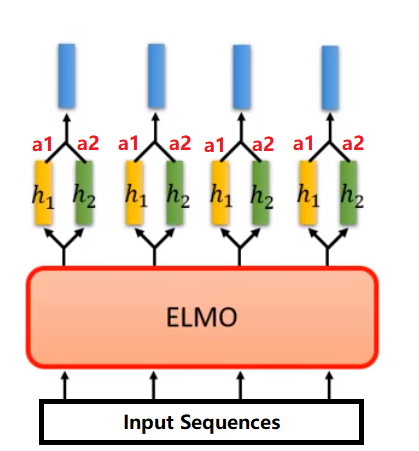
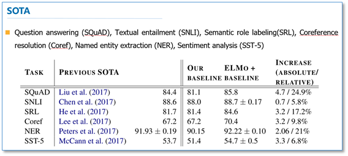
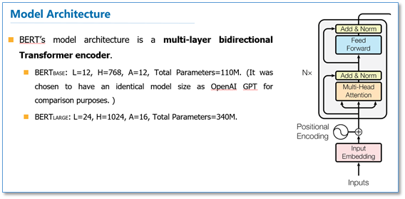
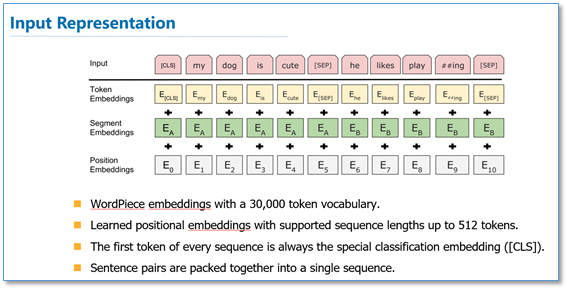
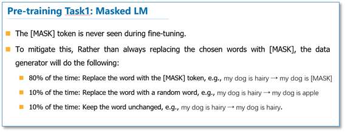
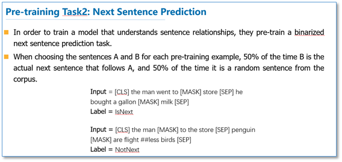
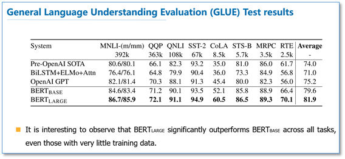

# Contexual Word Embedding

In tradition, the models we trained for word embedding cannot deal with the problem of one word multiple senses.

For example:
1. It is safe to deposit money in the bank.
2. They stood on the river bank to fish.

Thus, some contexualize-based models were put forward.

## 1. ELMO

Embedding from Language Model, ELMO in short, leverages language model to get pre-trained contexualized representation. The experiments shows that this model improved the performace on 6 NLP tasks of different types.

### 1.1 Architecture

In ELMO, the input sentences are sent into multipul layers of Bi-directional LSTM. The figure below shows a 2 layers ELMO model. The output, which is used in the specific NLP tasks, is the linear combination of the hidden layer in each LSTM layer. Which is to say, for different tasks, the parameters should be learnt differently.

### 1.2 Achievement

The model was tested in 6 NLP tasks of different types and **all advanced state-of-the-art (SOTA)**. The result is shown as follow.

## 2. BERT

Bidirectional Encoder Representations from Transformers, BERT in short, uses transformer encoder as the language model and a new pre-training objective: the masked language model (MLM). The model demonstrates the importance of bidirectional pre-training language representations.

The experiments shows that this model improved the performace on all 11 NLP tasks of different types.

### 2.1 Architecture

#### (1) Lanuage Model
For language model, BERT's model architecutre is a *multi-layer bidirectional transformer encoder*, with a small base structure and a large network structure.

#### (2) Input Representation
For input representation, the model uses wordpiece embedding with 30k-token-vocab, adds positional vectors, a seperator token between every 2 sentences and a classifier token in front of every text.

#### (3) Pretraining
Other than predict the next word in sentence, BERT put forward 2 new pretraining objectives: Masked LM (MLM), Next Sentence Prediction (NSP).

|  1st Task (MLM)   | 2nd Task (NSP)  |
|  ----  | ----  |
|   |  |

### 2.2 Achievement

+ The model got SOTA on **all 11 different NLP tasks**.
+ BERT_large outperforms much better than BERT_base across all tasks.
