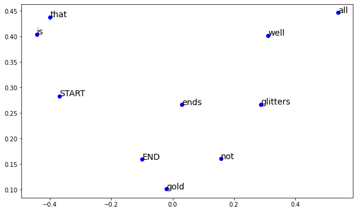

## Glove

In the last note, we introduced and discussed an important neural-network-based technique, **word2vec**, for word representation. In this section, I'll introduce another as much important as word2vec method: **Glove**.

To introduce co-occurrence based word representation, let me first explain what co-occurrence matrix is.

### 1. Co-Occurrence Based Word Representation

#### (1) Window based co-occurrence matrix
A co-occurrence matrix counts how often things co-occur in some environment. Given some word wi occurring in the document, we consider the context window surrounding wi. 

Supposing our fixed window size is n, then this is the n preceding and n subsequent words in that document, i.e. words wi-n…wi-1 and wi+1…wi+n. We build a co-occurrence matrix M, which is a symmetric word-by-word matrix in which Mij is the number of times wj appears inside wi's window.

>Example Co-Occurrence with Fixed Window of n=1:
 Document 1: "all that glitters is not gold"
 Document 2: "all is well that ends well"

|Counts|Start|all|that|glitters|is|not|gold|well|ends|END|
| :----: | :----: | :----: | :----: | :----: | :----: | :----: | :----: | :----: | :----: | :----: |
|Start|0|2|0|0|0|0|0|0|0|0|
|all|2|0|1|0|1|0|0|0|0|0|
|that|0|1|0|1|0|0|0|1|1|0|
|glitters|0|0|1|0|1|0|0|0|0|0|
|is|0|1|0|1|0|1|0|1|0|0|
|not|0|0|0|0|1|0|1|0|0|0|
|gold|0|0|0|0|0|1|0|0|0|1|
|well|0|0|1|0|1|0|0|0|1|1|
|ends|0|0|1|0|0|0|0|1|0|0|
|END|0|0|0|0|0|0|1|1|0|0|

Note:
+ In NLP, we often add START and END tokens to represent the beginning and end of sentences, paragraphs or documents. In thise case we imagine START and END tokens encapsulating each document.

The rows (or columns) of this matrix provide one type of word vectors (those based on word-word co-occurrence), but the vectors will be large in general (linear in the number of distinct words in a corpus). Thus, our next step is to run dimensionality reduction. In particular, we will run SVD (Singular Value Decomposition) to select the top k principal components.

#### (2) Singular Value Decomposition
Here's a visualization of dimensionality reduction with SVD. In this picture our co-occurrence matrix is A with n rows corresponding to n words. We obtain a full matrix decomposition, with the singular values ordered in the diagonal S matrix, and our new, shorter length-k word vectors in Uk.

In this case, the co-occurrence matrix should be decomposed as:
$$
    \begin{bmatrix}
        0 & 2 & 0 & 0 & 0 & 0 & 0 & 0 & 0 & 0 \\
        2 & 0 & 1 & 0 & 1 & 0 & 0 & 0 & 0 & 0 \\
        0 & 1 & 0 & 1 & 0 & 0 & 0 & 1 & 1 & 0 \\
        0 & 0 & 1 & 0 & 1 & 0 & 0 & 0 & 0 & 0 \\
        0 & 1 & 0 & 1 & 0 & 1 & 0 & 1 & 0 & 0 \\
        0 & 0 & 0 & 0 & 1 & 0 & 1 & 0 & 0 & 0 \\
        0 & 0 & 0 & 0 & 0 & 1 & 0 & 0 & 0 & 1 \\
        0 & 0 & 1 & 0 & 1 & 0 & 0 & 0 & 1 & 1 \\
        0 & 0 & 1 & 0 & 0 & 0 & 0 & 1 & 0 & 0 \\
        0 & 0 & 0 & 0 & 0 & 0 & 1 & 1 & 0 & 0 \\
    \end{bmatrix} = 
    \begin{matrix}
        U*eigen*V^T
    \end{matrix}
$$
For visualization, take the 2 most important principal components from matrix U as the x-y coordinates, we could draw the word representation plot.

Compared to one-hot encoding, co-occurrence based word representation has made some progress:
1. The embedded words are not sparse and very convinient for dimension decrease.
2. CO-occurrence matrix strengthens the positional connection between neighbour words.

But the problem of space-cost is not solved, and the problem of computation-cost is even worse:
1. It still need space linear with the number of the words, |V| in corpus.
2. The computational cost become to |V|3.

***
to be continued...