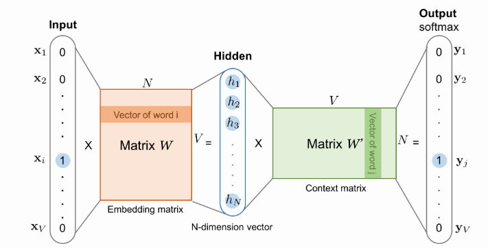
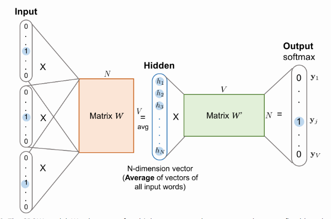

## 1. Working with text data

Text is one of the most widespread forms of sequence data. In NLP tasks, it's mostly understood as a sequence of words.

Like all other neural networks, deep-learning NLP models don't take as input raw test. Otherwise, they only work with numeric tensors. Thus, vectorizing text is a important process of transforming text into numeric tensors.
Typically, this process can be done through this way: Segment text into words, and transform each word into a vector. 

The units into which you can break down text are called *tokens*, and breading down text into such tokens is called *tokenization*. There're 2 main text-vectorization processeses: **one-hot encoding** and **word embedding**.

### 1.1 One-Hot Encoding

One-hot encoding is the most basic way to turn a token into a vector. It consists of associating a unique interger index with every word and turning this integer index *i* into a binary vector of the size of the vocabulary *N*. The vector is all zeros except for the i~th~ entry which is 1.

### 1.2 Word Embeddings

There're several drawbacks of one-hot encoding:
+ The matrix is sparse (mostly made of zeros).
+ Very high-dimensional.
+ Lack of connection between words have similar meaning.

Another popular and powerful way to associate a vector with a word is the use of dense word vectors, also called word embeddings.
Thus, word embedding, a low-dimensional floating point vectors, would be a very good complementary.

One way to implement word embedding is **word2vec** which would be introdced and discussed in detail in the following.

## 2. Word2Vec

To map a word to a vector, one of the most important purpose is that we want words with similar meaning would be mapped to similar vectors. Of course we want to train a model to find a great mapping function, but there's a big challenge here: We don't have explicit targets because these targets are exactly what we want.

The scientist came up with a solution to solve it: Build another context-based model which try to find the connection between central word and its context. And word embeddings are the accompanying products during the computation.

We can build a model either with the input of central word and the target of context words or with the input of context words and the target of central word. The former model is called **Skip Gram** and the latter model is called **CBow** (short for continuous bag-of-words).

### 2.1 Skip Gram Model

Suppose that you have a sliding window of a fixed size moving along a sentence: the word in the middle is the central word and those on its left and right within the sliding window are the context words. The skip-gram model (Mikolov et al., 2013) is trained to predict the probabilities of a word being a context word for the given target.

The following example shows how multiple pairs of target and context words are as training samples, generated by a 5-word window sliding along the sentence.
> “The man who passes the sentence should swing the sword.” 

| **Sliding Window (size=5)** | **Central Word**  | **Context** |
| ---- | ---- | ---- |
| [The man who] | the | man, who |
| [The man who passes] | man | the, who, passes |
| [The man who passes the] | who | the, man, passes, the|
| [man who passes the sentence] | passes | man, who, the, sentence |
| …	| …	| … |
| [sentence should swing the sword]	| swing	| sentence, should, the, sword |
| [should swing the sword] |the	| should, swing, sword |
| [swing the sword] | sword | swing, the |

Note: 
+ Each central-word-context pair is treated as a new observation in the data. For example, the first central word "the" in the above case produces 2 training samples: (the, man) and (the, who).
+ Both the input vector and the output are one-hot encoded word representations. The hidden layer is the word embedding of size.
+ The embedding matrix is at the size of (V, N), and its i~th~ row represents the mapped vector of i~th~ word in the vocabulary dictionary.

### 2.2 Continuos Bag-of-Words Model

The Continuous Bag-of-Words (CBOW) is another similar model for learning word vectors. It predicts the target word (i.e. “swing”) from source context words (i.e., “sentence should the sword”).

Note: 
+ The biggest difference in this model is that there are multiple contextual words, therefore we average their corresponding word vectors constructed by the multiplication of the input vector and the matrix W.
+ Other symbols have the same meanings as in skip-gram model.
+ Because the averaging stage smoothes over a lot of the distributional information, some people believe the CBOW model is better for small dataset.
